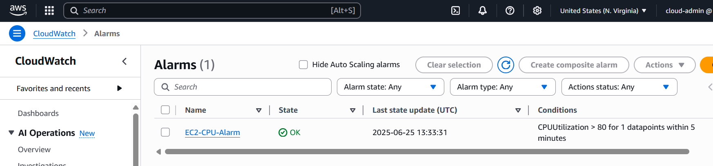
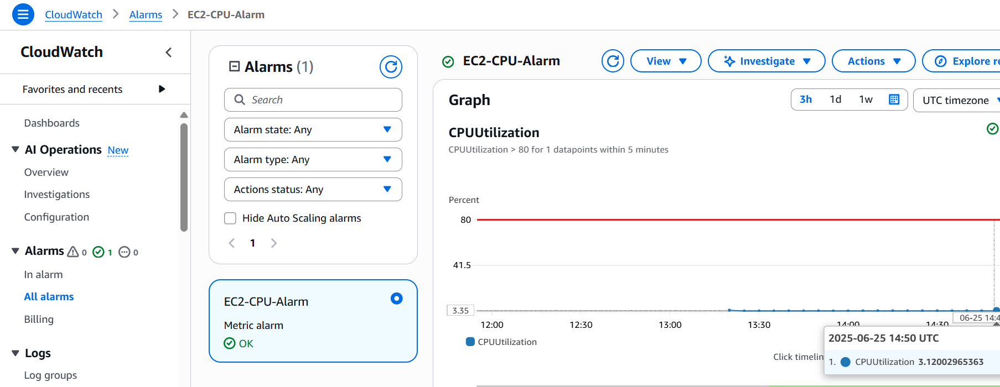

# Lab 3: AWS CloudWatch Monitoring
Objective: Monitor EC2 CPU usage.
Tools: AWS CloudWatch, EC2
Steps:
- Launched a t2.micro EC2 instance.
- Configured CloudWatch alarm for CPU usage > 80% for 5 minutes.
- Viewed CPU metrics in the CloudWatch dashboard.
Outcome: Successfully monitored EC2 performance.
**Screenshots**:
