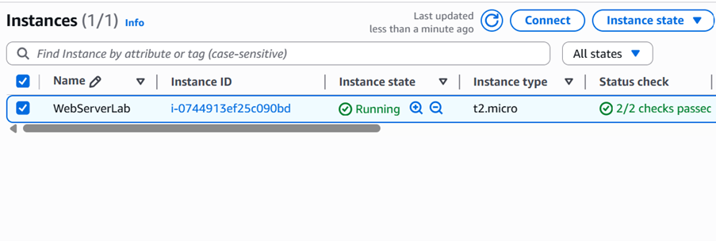
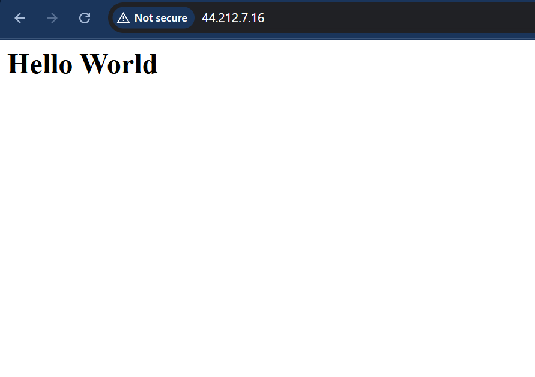

# Lab 1: AWS EC2 Web Server Setup
## Overview
This lab demonstrates deploying a web server on an AWS EC2 instance to host a static "Hello World" page, simulating a cloud support task of provisioning and securing compute resources.

## Objective
- Launch a Linux EC2 instance, install Apache, and host a static webpage.
- Configure security groups for secure access.

## Tools
- AWS EC2, Amazon Linux 2 AMI, Apache HTTP Server

## Detailed Steps
1. Accessed AWS Console: Signed into AWS Management Console, set region to us-east-1.
2. Launched EC2 Instance:
   - Selected Amazon Linux 2 AMI (Free Tier) and t2.micro instance type.
   - Created a key pair (`webserver-key.pem`) for SSH access.
   - Configured security group to allow HTTP (port 80) and SSH (port 22).
   - Launched instance named “WebServerLab.”
3. Connected to Instance: Used EC2 Instance Connect to access the instance via browser.
4. Installed Apache:
   - Ran commands:
     ```
     sudo yum update -y
     sudo yum install httpd -y
     sudo systemctl start httpd
     sudo systemctl enable httpd
     echo "<h1>Hello World</h1>" | sudo tee /var/www/html/index.html
     ```
5. Verified Output: Accessed the public IP of EC2 in a browser to confirm the “Hello World” page loaded.

## Challenges Faced
- Initially forgot to allow HTTP in the security group, resulting in a “connection refused” error. Resolved by adding a port 80 rule.
- Ensured instance was in “running” state before connecting, as premature attempts caused delays.

## Outcome
Successfully hosted a static webpage on an EC2 instance, accessible publicly, demonstrating skills in compute provisioning and basic networking.

## Screenshots
- : Shows running instance.
- : Displays “Hello World” output in browser.
