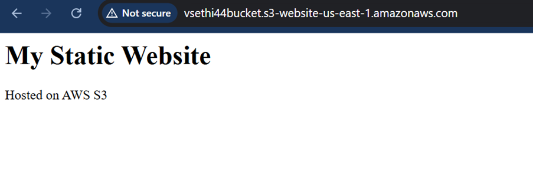

# Lab 2: AWS S3 Static Website
## Overview
This lab demonstrates hosting a static website on an AWS S3 bucket, a common task for cloud support engineers managing content delivery. The project mimics real-world scenarios like hosting landing pages or documentation sites, leveraging my troubleshooting skills from 10 years in technical support to ensure accessibility and security.

## Objective
- Create an S3 bucket, configure it for static website hosting, and make it publicly accessible.
- Upload a simple HTML page and verify it loads in a browser.

## Tools
- AWS S3

## Detailed Steps
1. Accessed AWS Console: Signed into AWS Management Console, set region to us-east-1 to ensure Free Tier compatibility.
2. Created S3 Bucket:
   - Navigated to S3 > “Create bucket.”
   - Named the bucket uniquely as “vsethi44bucket-<random>” to avoid conflicts.
   - Unchecked “Block all public access” to allow website hosting.
   - Kept other defaults and created the bucket.
3. Enabled Static Website Hosting:
   - In the bucket’s “Properties” tab, enabled “Static website hosting.”
   - Set “index.html” as the index document.
   - Noted the website endpoint (e.g., http://vsethi44bucket-<random>.s3-website-us-east-1.amazonaws.com).
4. Uploaded HTML File:
   - Created a simple `index.html` in Notepad:
     ```
     <html>
     <body>
       <h1>Welcome to my S3 Static Website!</h1>
     </body>
     </html>
     ```
   - Uploaded `index.html` to the bucket via the “Objects” tab.
5. Configured Bucket Policy:
   - In the “Permissions” tab, edited the bucket policy to allow public read access:
     ```
     {
         "Version": "2012-10-17",
         "Statement": [
             {
                 "Sid": "PublicReadGetObject",
                 "Effect": "Allow",
                 "Principal": "",
                 "Action": "s3:GetObject",
                 "Resource": "arn:aws:s3:::vsethi44bucket-<random>/"
             }
         ]
     }
     ```
6. Verified Website: Accessed the endpoint in a browser to confirm the “Welcome to my S3 Static Website!” page loaded.

## Challenges Faced
- Encountered a “policy has invalid resource” error due to “Block public access” being enabled initially. Resolved by disabling it and reapplying the policy.
- Misnamed the bucket initially, causing a conflict. Fixed by appending a random string to ensure uniqueness.

## Outcome
Successfully hosted a publicly accessible static website on S3, demonstrating skills in bucket configuration, access management, and troubleshooting.


**Screenshots**:

Shows bucket settings and uploaded file.

Displays the website in a browser.
