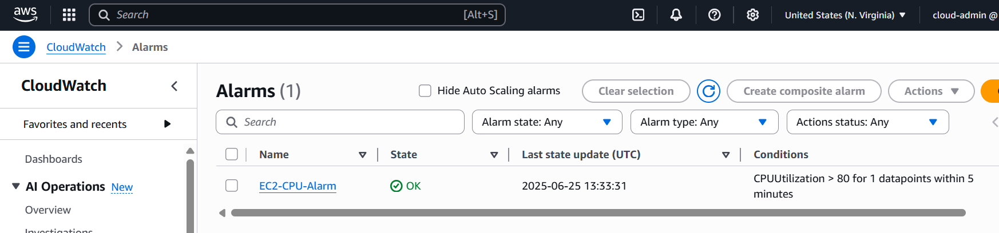
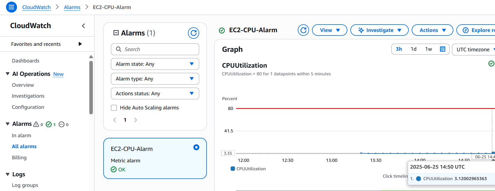

# Lab 3: AWS CloudWatch Monitoring
## Overview
This lab focuses on monitoring EC2 instance performance using AWS CloudWatch, a critical skill for cloud support engineers ensuring system health. It leverages my technical support experience in incident monitoring to set up alerts, similar to production environment tasks.

## Objective
- Launch an EC2 instance and configure a CloudWatch alarm to monitor CPU usage.
- View performance metrics to ensure operational stability.

## Tools
- AWS CloudWatch, AWS EC2, Amazon Linux 2 AMI

## Detailed Steps
1. Accessed AWS Console: Signed in, set region to us-east-1 for Free Tier usage.
2. Launched EC2 Instance:
   - Navigated to EC2 > “Launch Instance,” named it “CloudWatchLab.”
   - Selected Amazon Linux 2 AMI, t2.micro instance type.
   - Configured security group to allow SSH (port 22).
   - Created/downloaded key pair (`cloudwatch-key.pem`) and launched.
3. Set Up CloudWatch Alarm:
   - Went to CloudWatch > “Alarms” > “Create alarm.”
   - Selected “EC2” > “Per-Instance Metrics” > “CPUUtilization” for “CloudWatchLab.”
   - Set condition: CPU > 80% for 5 minutes.
   - Configured no notification (Free Tier), named alarm “EC2-CPU-Alarm,” created.
4. Viewed Metrics:
   - In CloudWatch > “Metrics” > “EC2” > “Per-Instance Metrics,” selected “CloudWatchLab.”
   - Observed CPUUtilization graph, noting low usage (~5–10%) typical for Free Tier.
5. Verified Alarm Status: Checked “Alarms” tab to confirm “OK” status (no CPU spikes).

## Challenges Faced
- CPU usage was low, so the alarm remained in “OK” state. Learned this is expected for a new instance without load.
- Took time to locate the correct metric in CloudWatch; resolved by following the EC2 metrics path.

## Outcome
Successfully monitored EC2 CPU usage with a CloudWatch alarm, demonstrating skills in performance monitoring and alert setup.

**Screenshots**:
 Displays alarm configuration and status.
 Shows CPUUtilization metrics.
