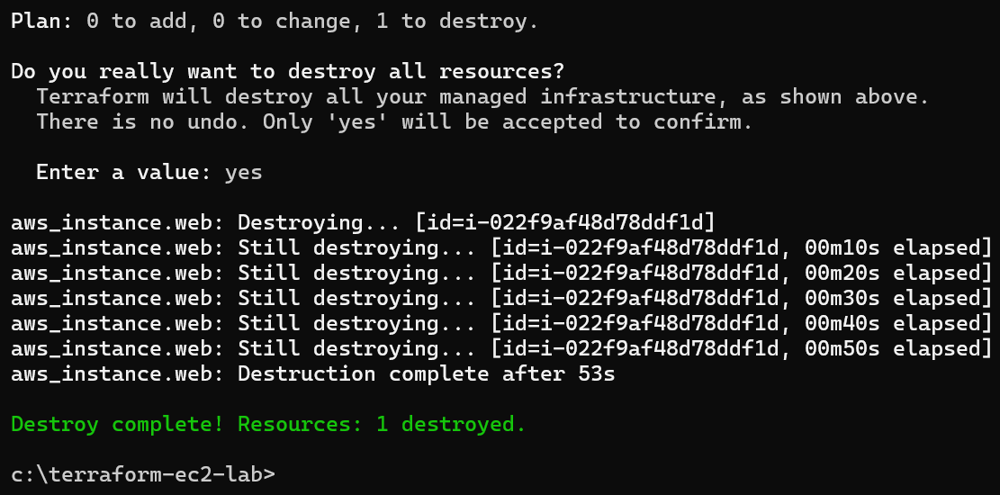

# Lab 4: Terraform EC2 Setup
## Overview
This lab automates EC2 instance deployment using Terraform, showcasing Infrastructure as Code (IaC) skills essential for cloud engineers. It mirrors my technical support experience in automating repetitive tasks, applied to cloud infrastructure provisioning.

## Objective
- Use Terraform to deploy an EC2 instance and verify it in the AWS Console.
- Clean up resources using Terraform destroy.

## Tools
- Terraform, AWS EC2, Amazon Linux 2 AMI

## Detailed Steps
1. Installed Terraform:
   - Downloaded `terraform_1.12.2_windows_amd64.zip` from terraform.io.
   - Unzipped to `C:\Terraform` and added to system PATH.
   - Verified with `terraform --version` in Command Prompt.
2. Configured AWS CLI:
   - Installed AWS CLI, ran `aws configure` with “terraform-user” IAM credentials (Access Key, Secret Key, us-east-1, json).
3. Created Terraform Script:
   - Created folder `C:\terraform-ec2-lab`.
   - Added `main.tf` with:
     ```
     provider "aws" {
       region = "us-east-1"
     }
     resource "aws_instance" "web" {
       ami           = "ami-09e6f87a47903347c"
       instance_type = "t2.micro"
       tags = {
         Name = "TerraformWebServer"
       }
     }
     ```
4. Deployed with Terraform:
   - Ran `cd C:\terraform-ec2-lab`, then:
     ```
     terraform init
     terraform apply
     ```
   - Confirmed “yes” to deploy, waited ~2 minutes.
5. Verified Instance: Checked AWS Console > EC2 > Instances for “TerraformWebServer.”
6. Cleaned Up: Ran `terraform destroy`, confirmed “yes” to terminate instance.

## Challenges Faced
- Faced “Terraform initialized in an empty directory” error due to `main.tf.txt` extension. Fixed by renaming to `main.tf`.
- Ensured “terraform-user” IAM role had “AmazonEC2FullAccess” policy to avoid permission errors.

## Outcome
Successfully automated EC2 deployment using Terraform, demonstrating IaC proficiency and resource management.


**Screenshots**:

Shows `terraform apply` output.


Displays running instance.


Confirms deployment.


Shows destroy command.


Confirms cleanup.
