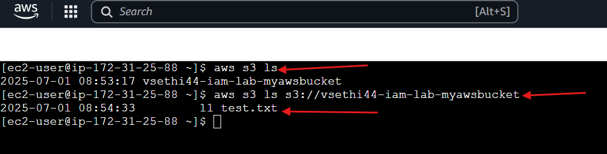

# Lab 5: IAM Role for EC2 with S3 Access
Objective: Grant EC2 secure access to S3 using an IAM role.
Tools: AWS IAM, EC2, S3
Steps:
- Created S3 bucket “vsethi44-iam-lab-<random>” and uploaded test.txt.
- Created IAM role “EC2S3AccessRole” with AmazonS3ReadOnlyAccess.
- Launched EC2 instance with the role, tested access with “aws s3 ls.”
Outcome: Successfully accessed S3 without credentials.
Screenshots:

