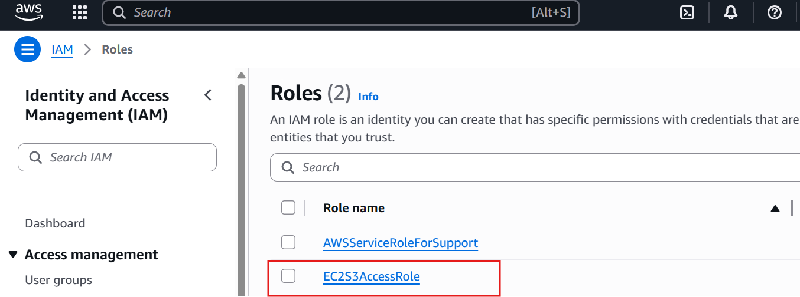

# Lab 5: IAM Role for EC2 with S3 Access
## Overview
This lab configures an IAM role to allow an EC2 instance to access an S3 bucket securely, a key cloud support task for managing permissions. It builds on my troubleshooting experience from Capgemini, ensuring secure resource access without hard-coded credentials.

## Objective
- Create an IAM role, attach it to an EC2 instance, and test S3 access.
- Verify secure access using AWS CLI on the instance.

## Tools
- AWS IAM, AWS EC2, AWS S3, Amazon Linux 2 AMI

## Detailed Steps
1. Accessed AWS Console: Signed in, set region to us-east-1.
2. Created S3 Bucket:
   - Navigated to S3 > “Create bucket,” named it “vsethi44-iam-lab-<random>.”
   - Unchecked “Block all public access” for testing, created bucket.
   - Uploaded `test.txt` with “Hello, S3!” via Notepad.
3. Created IAM Role:
   - Went to IAM > “Roles” > “Create role.”
   - Selected “AWS service” > “EC2” as trusted entity.
   - Attached “AmazonS3ReadOnlyAccess” policy.
   - Named role “EC2S3AccessRole,” added tag “Lab: IAM,” created.
4. Launched EC2 Instance:
   - In EC2 > “Launch Instance,” named it “IAMLabEC2.”
   - Selected Amazon Linux 2 AMI, t2.micro.
   - Assigned “EC2S3AccessRole” under “Advanced details.”
   - Allowed SSH (port 22), created key pair (`iam-key.pem`), launched.
5. Tested S3 Access:
   - Connected to EC2 via EC2 Instance Connect.
   - Ran:
     ```
     aws s3 ls s3://vsethi44-iam-lab-myawsbucket
     ```
   - Confirmed output listed `test.txt`.
6. Cleaned Up:
   - Terminated EC2 instance in EC2 console.
   - Emptied and deleted S3 bucket.

## Challenges Faced
- Initial `aws s3 ls` failed due to missing IAM role assignment. Fixed by attaching “EC2S3AccessRole” to the instance.
- Took time to locate the correct S3 bucket ARN for testing; verified via S3 console.

## Outcome
Successfully enabled secure S3 access for an EC2 instance using an IAM role, demonstrating permission management skills.


Screenshots:

Shows role configuration.


Displays role assigned to EC2.


Shows uploaded file.


Confirms `aws s3 ls` output.
