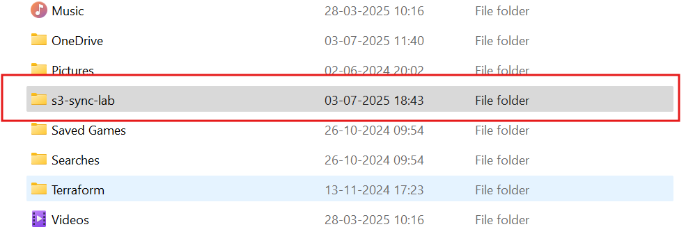

# Lab 6: AWS CLI S3 Sync
## Overview
This lab automates the synchronization of local files to an AWS S3 bucket using AWS CLI, a common task for cloud support engineers managing data transfers. It leverages my 10 years of troubleshooting experience from Capgemini and Dell to ensure accurate automation and verification, mirroring production-level data management workflows.

## Objective
- Create a local folder with a file and sync it to an S3 bucket using AWS CLI.
- Verify the file upload in the AWS S3 Console.

## Tools
- AWS CLI, AWS S3

## Detailed Steps
1. Installed and Configured AWS CLI:
   - Downloaded and installed AWS CLI for Windows from aws.amazon.com/cli.
   - Ran `aws --version` in Command Prompt to confirm installation (e.g., aws-cli/2.x.x).
   - Configured CLI with IAM user (“terraform-user”) credentials:
     ```
     aws configure
     ```
     - Entered Access Key ID, Secret Access Key, region (us-east-1), and output format (json).
2. Created Local Folder and File:
   - Created a folder `C:\Users\harry\s3-sync-lab` on my Windows PC.
   - Added a file `test2.txt` using Notepad with content: “Hello, S3 Sync Lab!”.
3. Created S3 Bucket:
   - Signed into AWS Console, set region to us-east-1.
   - Navigated to S3 > “Create bucket,” named it “vsethi44-lab-cli-myawsbucket.”
   - Unchecked “Block all public access” for testing, kept defaults, and created the bucket.
4. Synced Files to S3:
   - In Command Prompt, navigated to the local folder:
     ```
     cd C:\Users\harry\s3-sync-lab
     ```
   - Ran:
     ```
     aws s3 sync . s3://vsethi44-lab-cli-myawsbucket
     ```
   - Confirmed output: `upload: .\test2.txt to s3://vsethi44-lab-cli-myawsbucket/test2.txt`.
5. Verified Upload:
   - In AWS Console > S3 > “vsethi44-lab-cli-myawsbucket,” confirmed `test2.txt` was listed.
   - Optionally downloaded the file to verify content matched.
6. Cleaned Up:
   - Emptied the bucket via S3 Console > “Empty.”
   - Deleted the bucket to avoid Free Tier costs.

## Challenges Faced
- Encountered a “bucket does not exist” error due to a typo in the bucket name. Fixed by double-checking the name in the S3 Console.
- Ensured the IAM user had “AmazonS3FullAccess” policy to avoid permission errors during sync.

## Outcome
Successfully automated file uploads to an S3 bucket using AWS CLI, demonstrating skills in command-line automation and data management for cloud support roles.

## Screenshots
- : Verifies AWS CLI installation and version on my system.
- : Shows the `s3-sync-lab` folder created locally for file storage.
- : Displays the content of `test2.txt` prepared for syncing.
- : Confirms the creation of “vsethi44-lab-cli-myawsbucket” in the AWS Console.
- : Shows the `aws s3 sync` command output, indicating successful file upload.
- : Displays `test2.txt` in the S3 bucket post-sync, verifying the upload.

