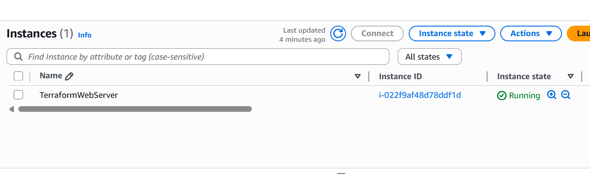
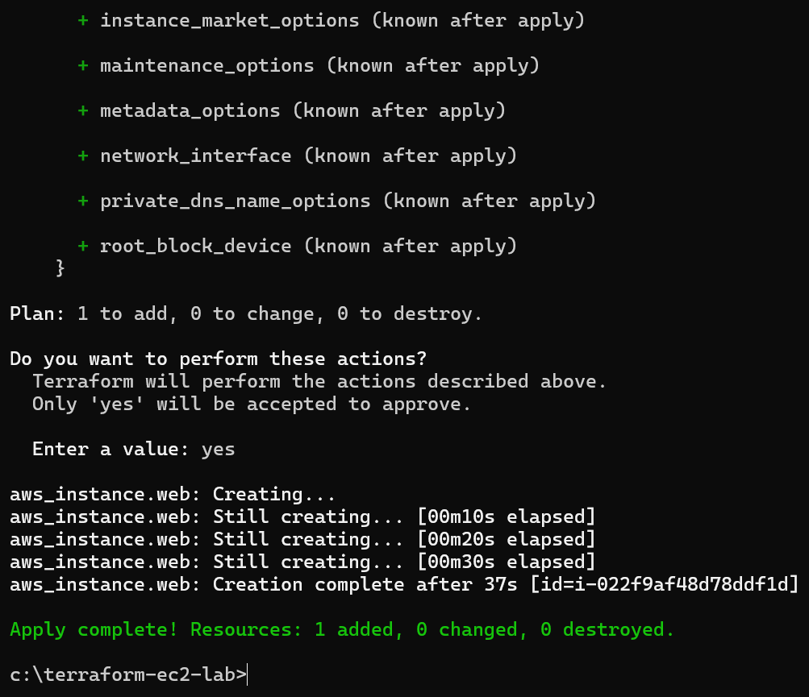
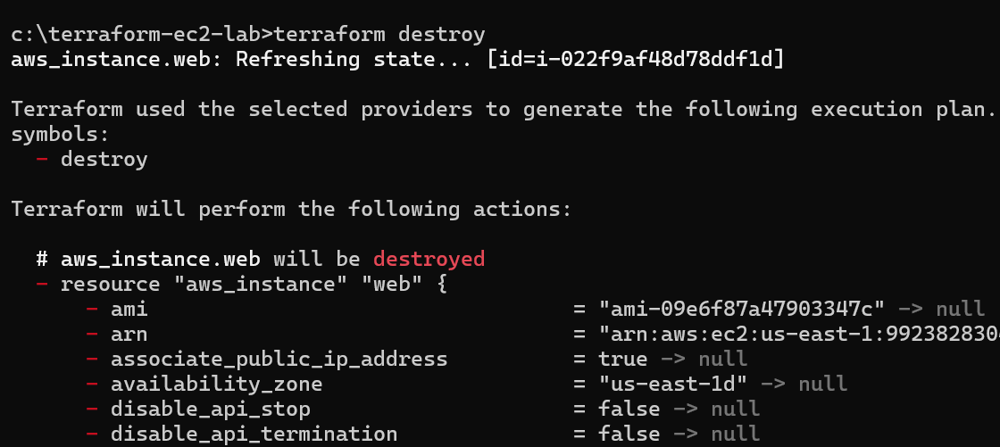
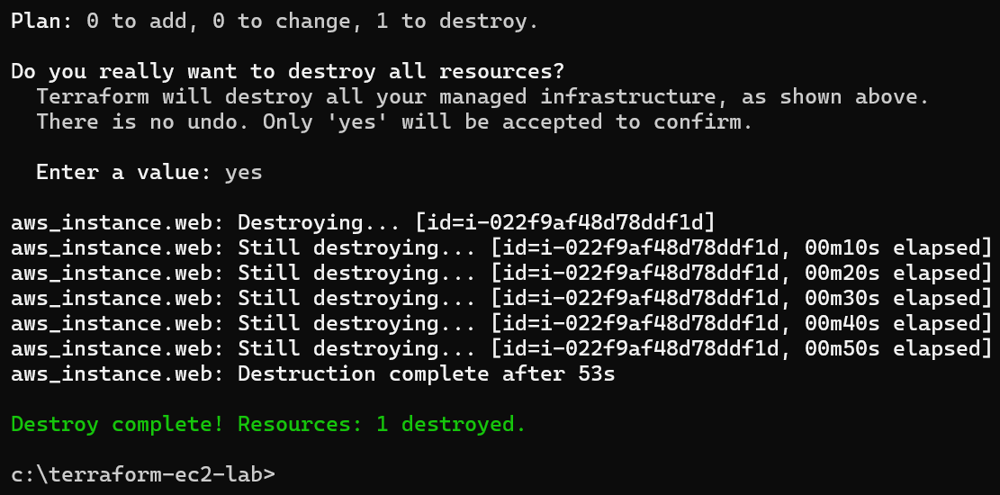

# Lab 4: Terraform EC2 Setup
Objective: Automate EC2 deployment with Terraform.
Tools: Terraform, AWS EC2
Steps:
- Installed Terraform and configured AWS credentials.
- Created main.tf to launch a t2.micro EC2 instance in us-east-1.
Ran' terraform apply' to deploy and verified in the AWS Console.
Outcome: Successfully automated EC2 setup.
**Screenshots**:

